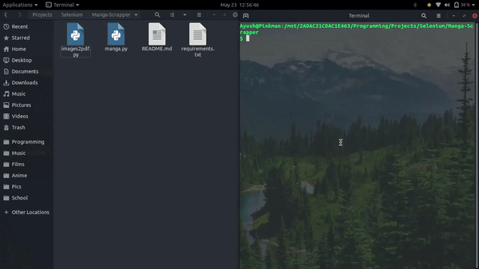

# Manga-Scraper

## Introduction
This script downloads manga from kissmanga.com

## Contents
<!-- * [Demo](ttps://github.com/diayush/Manga-Scrapper/#Demo) -->
* [Installation](https://github.com/diayush/Manga-Scrapper/#Installation)
* [Usuage](https://github.com/diayush/Manga-Scrapper/#Usuage)
* [Features](https://github.com/diayush/Manga-Scrapper/#Features)
* [Bugs](https://github.com/diayush/Manga-Scrapper/#Bugs)

<!-- ## Demo -->
<!--  -->

## Installation
* Install 3.8 from [here](https://www.python.org/downloads/release/python-382/)
* Install git from [here](https://git-scm.com/downloads)
* Run `git clone https://github.com/diayush/Manga-Scrapper.git`
* Run `pip install -r requirements.txt`
* Download ChromeDriver From [here](https://chromedriver.chromium.org/downloads)
* Add the location of ChromeDriver into environmental variables and save it as "chromedriver"

## Usage
* Change the "save_path" variable in the starting of the `manga.py` file if you wanna change manga directory to somewhere else.(By Default it's the same directory as the script)
* Execute `manga.py`.
* Enter The URL of the manga from kissmanga.com
* Enter the chapter range
* Enjoy!

## Features

* Downloads all images of a chapter and puts them in a seperate folder.
* Creates A PDF of each chapter outside the directory and deletes the chapter directory as it is no longer needed.

## Bugs

* If you're using brave browser or a adblocker, a pop-up might come in between and might give an error, and you might have to retry
* There's a chance if you download too many pages that kissmanga.com might stop the process as you're sending too many requests in a short time and might give an error. You can then try running the script again after 10 seconds.
* This script is still a lot buggy but usually rerunnning the script will solve the problem.

